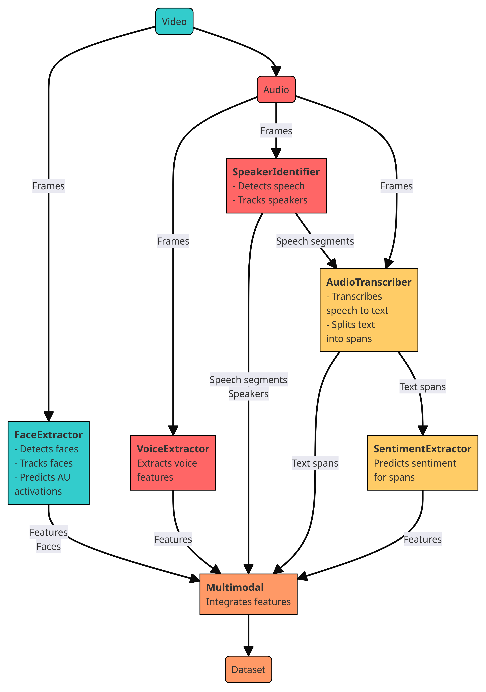

# Multimodal Emotion Expression Capture Amsterdam

[](https://github.com/mexca/mexca)
[](https://research-software-directory.org/software/mexca)
[](https://mexca.readthedocs.io/en/latest/index.html)
[](https://fair-software.eu)
[](https://sonarcloud.io/dashboard?id=mexca_mexca)
[](https://sonarcloud.io/dashboard?id=mexca_mexca)
[](https://github.com/mexca/mexca/actions/workflows/build.yml)
[](https://github.com/mexca/mexca/actions/workflows/cffconvert.yml)
[](https://github.com/mexca/mexca/actions/workflows/markdown-link-check.yml)
[](https://zenodo.org/badge/latestdoi/500818250)
[](https://hub.docker.com/u/mexca)
[](https://github.com/mexca/mexca/actions/workflows/docker.yml)
[](https://github.com/psf/black)

<div align="center">

</div>

mexca is an open-source Python package which aims to capture human emotion expressions from videos in a single pipeline.

## How To Use Mexca

mexca implements the customizable yet easy-to-use Multimodal Emotion eXpression Capture Amsterdam (MEXCA) pipeline for extracting emotion expression features from videos.
It contains building blocks that can be used to extract features for individual modalities (i.e., facial expressions, voice, and dialogue/spoken text).
The blocks can also be integrated into a single pipeline to extract the features from all modalities at once.
Next to extracting features, mexca can also identify the speakers shown in the video by clustering speaker and face representations.
This allows users to compare emotion expressions across speakers, time, and contexts.

Please cite mexca if you use it for scientific or commercial purposes.

<div align="center">

</div>

## Installation

mexca can be installed on Windows, macOS and Linux. We recommend Windows 10, macOS 12.6.x, or Ubuntu. The base package can be installed from PyPI via `pip`:

```console
pip install mexca
```

The dependencies for the additional components can be installed via:

```console
pip install mexca[vid,spe,voi,tra,sen]
```

or:

```console
pip install mexca[all]
```

The abbreviations indicate:

* `vid`: FaceExtractor
* `spe`: SpeakerIdentifier
* `voi`: VoiceExtractor
* `tra`: AudioTranscriber
* `sen`: SentimentExtractor

For details on the requirements and installation procedure, see the [Quick Installation](https://mexca.readthedocs.io/en/latest/quick_installation.html) and [Installation Details](https://mexca.readthedocs.io/en/latest/installation_details.html) sections of our documentation.

## Getting Started

If you would like to learn how to use mexca, take a look at our [demo](https://github.com/mexca/mexca/tree/main/examples) notebook and the [Getting Started](https://mexca.readthedocs.io/en/latest/getting_started.html) section of our documentation.

## Examples and Recipes

In the `examples/` folder, we currently provide two Jupyter notebooks (and a short demo):

- [example_custom_pipeline_components](https://github.com/mexca/mexca/blob/main/examples/example_custom_pipeline_components.ipynb) shows how the standard MEXCA pipeline can be customized and extended
- [example_emotion_feature_extraction](https://github.com/mexca/mexca/blob/main/examples/example_emotion_feature_extraction.ipynb) shows how to apply the MEXCA pipeline to a video and conduct a basic analysis of the extracted features

The `recipes/` folder contains two Python scripts that can easily be reused in a new project:

- [recipe_postprocess_features](https://github.com/mexca/mexca/blob/main/recipes/recipe_postprocess_features.py) applies a standard postprocessing routine to extracted features
- [recipe_standard_pipeline](https://github.com/mexca/mexca/blob/main/recipes/recipe_standard_pipeline.py) applies the standard MEXCA pipeline to a list of videos

## Components

The pipeline components are described [here](https://mexca.readthedocs.io/en/latest/components.html).

## Documentation

The documentation of mexca can be found on [Read the Docs](https://mexca.readthedocs.io/en/latest/index.html).

## Contributing

If you want to contribute to the development of mexca,
have a look at the [contribution guidelines](CONTRIBUTING.md).

## License

The code is licensed under the Apache 2.0 License. This means that mexca can be used, modified and redistributed for free, even for commercial purposes.

## Credits

Mexca is being developed by the [Netherlands eScience Center](https://www.esciencecenter.nl/) in collaboration with the [Hot Politics Lab](http://www.hotpolitics.eu/) at the University of Amsterdam.

This package was created with [Cookiecutter](https://github.com/audreyr/cookiecutter) and the [NLeSC/python-template](https://github.com/NLeSC/python-template).

[^1]: We explain the rationale for this setup in the [Docker](https://mexca.readthedocs.io/en/latest/docker.html) section.
