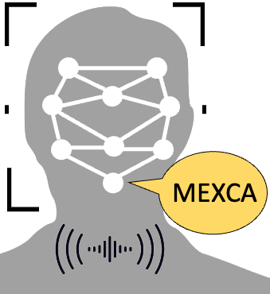

# Multimodal Emotion Expression Capture Amsterdam

[](https://github.com/mexca/mexca)
[](https://research-software-directory.org/software/mexca)
[](https://mexca.readthedocs.io/en/latest/index.html)
[](https://fair-software.eu)
[](https://sonarcloud.io/dashboard?id=mexca_mexca)
[](https://sonarcloud.io/dashboard?id=mexca_mexca)
[](https://github.com/mexca/mexca/actions/workflows/build.yml)
[](https://github.com/mexca/mexca/actions/workflows/cffconvert.yml)
[](https://github.com/mexca/mexca/actions/workflows/markdown-link-check.yml)
[](https://zenodo.org/badge/latestdoi/500818250)
[](https://hub.docker.com/u/mexca)
[](https://github.com/mexca/mexca/actions/workflows/docker.yml)

<div align="center">

</div>

mexca is an open-source Python package which aims to capture human emotion expressions from videos in a single pipeline.

## How To Use Mexca

mexca implements the customizable yet easy-to-use Multimodal Emotion eXpression Capture Amsterdam (MEXCA) pipeline for extracting emotion expression features from videos. 
It contains building blocks that can be used to extract features for individual modalities (i.e., facial expressions, voice, and dialogue/spoken text). 
The blocks can also be integrated into a single pipeline to extract the features from all modalities at once. 
Next to extracting features, mexca can also identify the speakers shown in the video by clustering speaker and face representations. 
This allows users to compare emotion expressions across speakers, time, and contexts.

Please cite mexca if you use it for scientific or commercial purposes.

<div align="center">

</div>

## Quick Installation

Here, we explain briefly how to install mexca on your system. Detailed instructions can be found in the [Installation Details](https://mexca.readthedocs.io/en/latest/installation_details.html) section.
mexca can be installed on Windows, macOS and Linux. We recommend Windows 10, macOS 12.6.x, or Ubuntu.

The package contains five components that must be explicitly installed [^1]. By default, only the base package is installed
(which requires only a few dependencies). The components can still be used through Docker containers which must be downloaded
from Docker Hub. We recommend this setup for users with little experience with installing Python packages or who simply want to
quickly try out the package. Using the containers also adds stability to your program.

### Requirements

mexca requires Python version >= 3.7 and <= 3.9. It further depends on [FFmpeg](https://ffmpeg.org/) (for video and audio processing), 
which is usually automatically installed through the MoviePy package (i.e., its imageio dependency). In case the automatic install fails, 
it must be installed manually.

To download and run the components as Docker containers, Docker must be installed on your system. Instructions on how to install
Docker Desktop can be found [here](https://www.docker.com/get-started/).

All components but the VoiceExtractor depend on PyTorch (version 1.12). Usually, it should be automatically installed when specifying any
of these components. In case the installation fails, see the installation instructions on the PyTorch [web page](https://pytorch.org/get-started/locally/).

For the SpeakerIdentifier component, the library [libsndfile](https://libsndfile.github.io/libsndfile/) must also be installed on Linux systems.

The SentimentExtractor component depends on the [sentencepiece](https://github.com/google/sentencepiece) library,
which is automatically installed if [Git](https://git-scm.com/) is installed on the system.

### Installation

We recommend installing mexca in a new virtual environment to avoid dependency conflicts. The base package can be installed from PyPI via `pip`:

```console
pip install mexca
```

The dependencies for the additional components can be installed via:

```console
pip install mexca[vid,spe,voi,tra,sen]
```

or:

```console
pip install mexca[all]
```

The abbreviations indicate:

* `vid`: FaceExtractor
* `spe`: SpeakerIdentifier
* `voi`: VoiceExtractor
* `tra`: AudioTranscriber
* `sen`: SentimentExtractor

To run the demo and example notebooks, install the Jupyter requirements via:

```console
pip install mexca[demo]
```

## Getting Started

If you would like to learn how to use mexca, take a look at our [example](https://github.com/mexca/mexca/tree/main/examples) notebook.

*Note*: mexca builds on pretrained models from the pyannote.audio package. Since release 2.1.1, downloading the pretrained models requires the user to accept two user agreements on Hugging Face hub and generate an authentication token. Therefore, to run the mexca pipeline, please accept the user agreements on [here](https://huggingface.co/pyannote/speaker-diarization) and [here](https://huggingface.co/pyannote/segmentation). Then, generate an authentication token [here](https://huggingface.co/settings/tokens). Use this token to login to Hugging Face hub by running `notebook_login()` (from a jupyter notebook) or `huggingface-cli login` (from the command line). You only need to login when running mexca for the first time. See this [link](https://huggingface.co/docs/hub/models-adding-libraries) for details. When running container components, you need to supply the token excplicitly as value for the `use_auth_token` argument. We recommend storing the token on your system and accessing it from Python.

To create and apply the MEXCA pipeline with container components to a video file run the following code in a Jupyter notebook or a Python script (requires the base package and Docker):

```python
from mexca.container import (AudioTranscriberContainer, FaceExtractorContainer,
                             SentimentExtractorContainer, SpeakerIdentifierContainer, 
                             VoiceExtractorContainer)
from mexca.pipeline import Pipeline

# Set path to video file
filepath = 'path/to/video'

# Create standard pipeline with two faces and speakers
pipeline = Pipeline(
    face_extractor=FaceExtractorContainer(num_faces=2),
    speaker_identifier=SpeakerIdentifierContainer(
        num_speakers=2,
        use_auth_token="HF_TOKEN" # Replace this string with your token
    ),
    voice_extractor=VoiceExtractorContainer(),
    audio_transcriber=AudioTranscriberContainer(),
    sentiment_extractor=SentimentExtractorContainer()
)

# Apply pipeline to video file at `filepath`
result = pipeline.apply(
    filepath,
    frame_batch_size=5,
    skip_frames=5
)

# Print merged features
print(result.features)
```

The result should be a pandas data frame printed to the console or notebook output. Details on the output and extracted features can be found [here](https://mexca.readthedocs.io/en/latest/output.html).

## Components

The pipeline components are described [here](https://mexca.readthedocs.io/en/latest/components.html).

## Documentation

The documentation of mexca can be found on [Read the Docs](https://mexca.readthedocs.io/en/latest/index.html).

## Contributing

If you want to contribute to the development of mexca,
have a look at the [contribution guidelines](CONTRIBUTING.md).

## License

The code is licensed under the Apache 2.0 License. This means that mexca can be used, modified and redistributed for free, even for commercial purposes.

## Credits

Mexca is being developed by the [Netherlands eScience Center](https://www.esciencecenter.nl/) in collaboration with the [Hot Politics Lab](http://www.hotpolitics.eu/) at the University of Amsterdam.

This package was created with [Cookiecutter](https://github.com/audreyr/cookiecutter) and the [NLeSC/python-template](https://github.com/NLeSC/python-template).

[^1]: We explain the rationale for this setup in the [Docker](https://mexca.readthedocs.io/en/latest/docker.html) section.